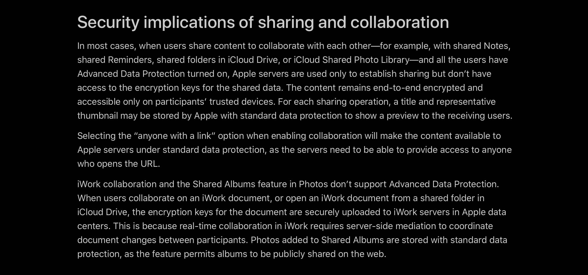

<figure class="mw848">

<figcaption>

</figcaption>
</figure>

Let's talk about [Advanced Data Protection for iCloud](https://support.apple.com/guide/security/advanced-data-protection-for-icloud-sec973254c5f/web).

The upshot of this sentence in the [“Security implications of sharing and collaboration” section](https://support.apple.com/guide/security/advanced-data-protection-for-icloud-sec973254c5f/web#secdd4a5beab): 

> iWork collaboration and the Shared Albums feature in Photos don’t support Advanced Data Protection.

…for me, was that my wallpaper on my phone immediately disappeared and I was unable to access years of “photos added to Shared Albums.”

Not only on my phone. Those  years of “photos added to Shared Albums,” were now inaccessible on any of my devices because they “are stored with standard data protection, as the feature permits albums to be publicly shared on the web.” Does anyone know if this is expected behavior or something I should try to report?

If it is indeed expected behavior to vaporize all shared albums until Advanced Data Protection is disabled (the albums and photos do return, once ADP is disabled), that’s huge bummer that I suspect will make this urgently needed protection a dealbreaker to most who attempt to enable it.

Also beyond shared albums, which are already widely used, if Apple wants iWork collaboration to find traction, making it work for people who want “their trusted devices [to] retain sole access to the encryption keys for the majority of their iCloud data” would seem to be wise.
