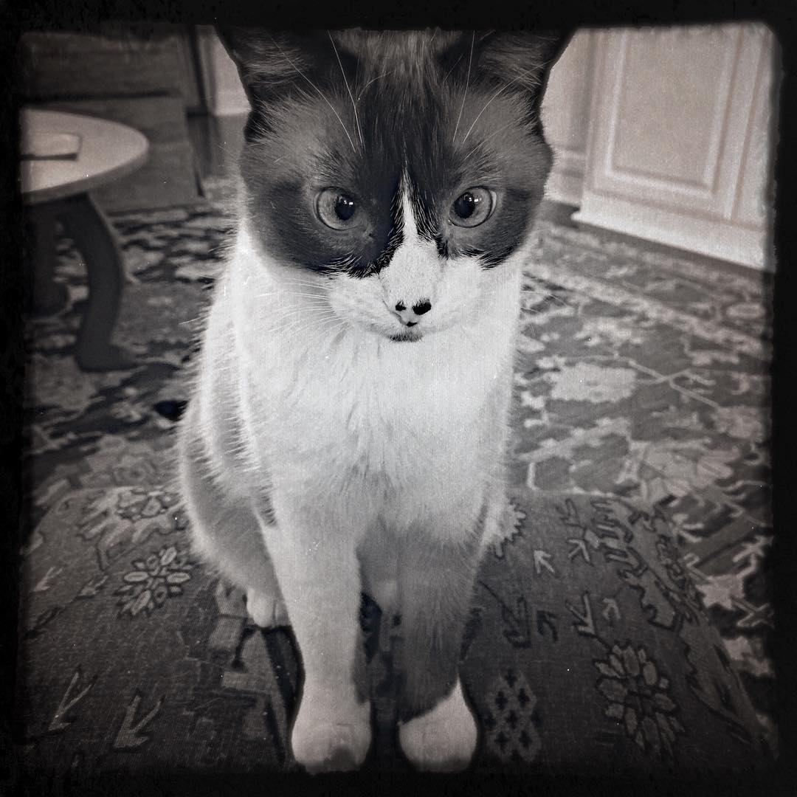

<figure class="mw408">
 
<figcaption>
  ascomycota
</figcaption>
</figure>

> Familiar examples of sac fungi include morels, truffles, brewer’s yeast and baker’s yeast, dead man’s fingers, and cup fungi.

– [Ascomycota on Wikipedia](https://en.wikipedia.org/wiki/Ascomycota)
