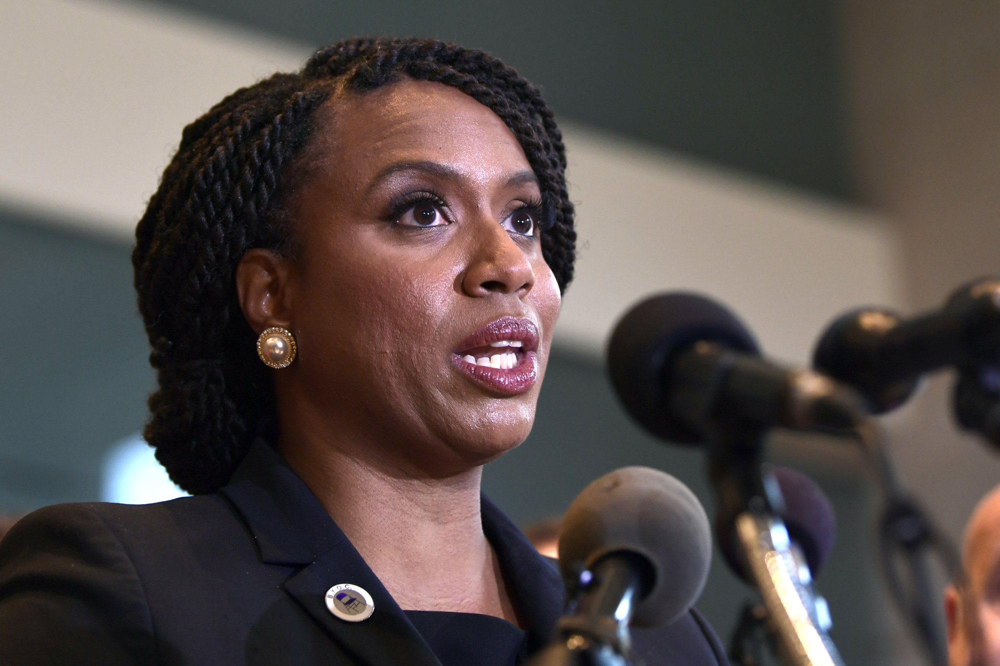
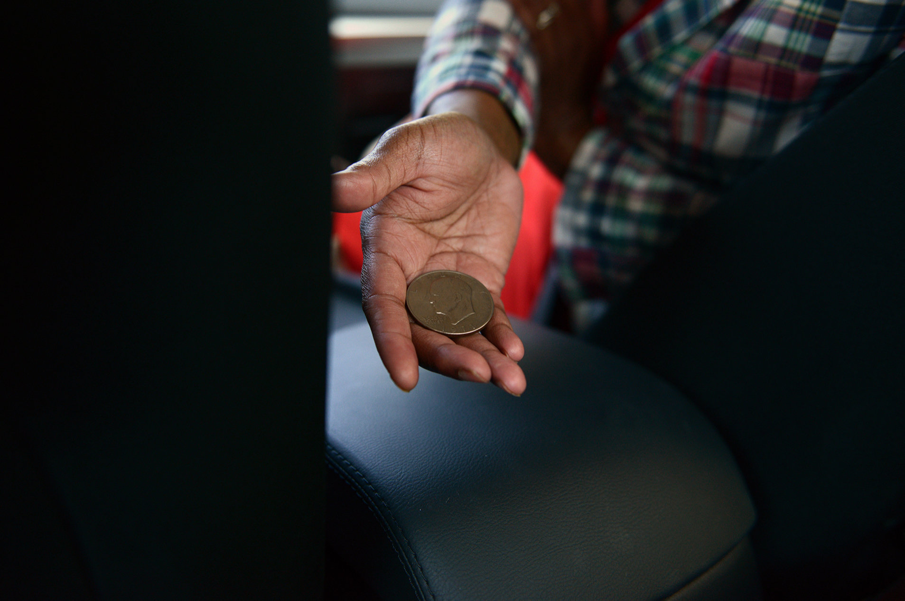
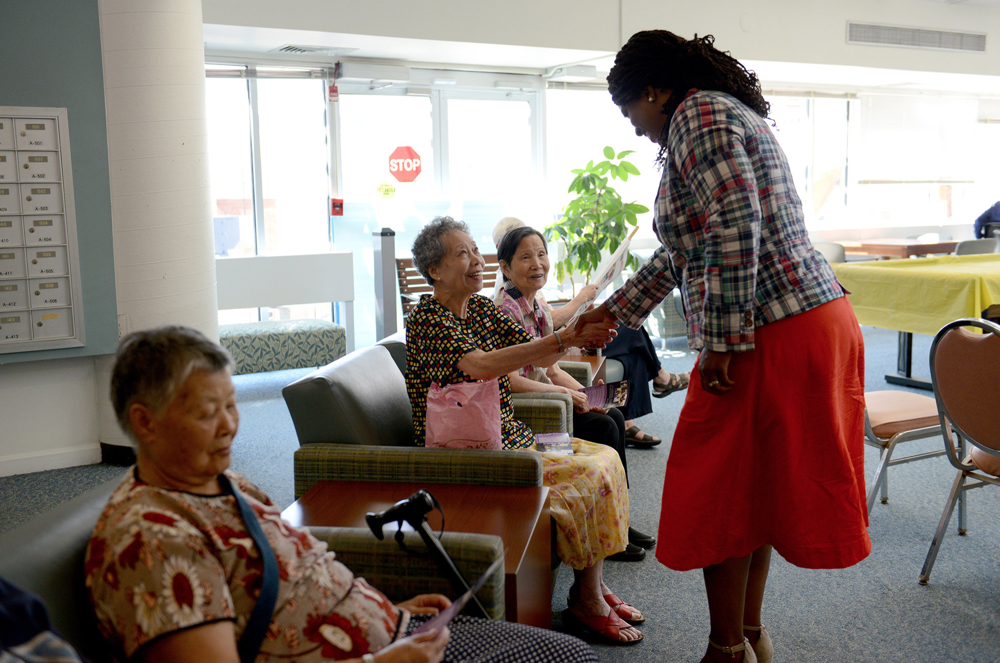
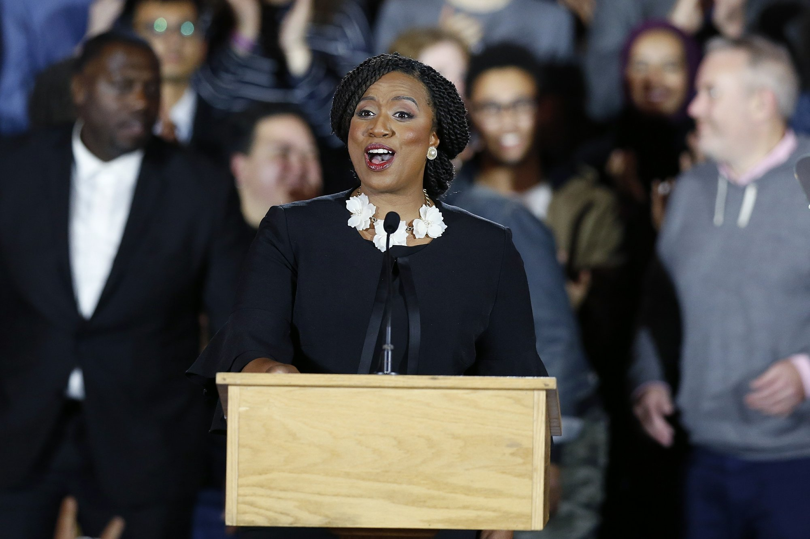

<figure class="mw640">
 
<figcaption>
Rep.-elect Ayanna Pressley, D-Mass., listens during a news conference with members of the Progressive Caucus in Washington, Monday, Nov. 12, 2018. 
<small>(Photo source: <a href="https://apnews.com/9dbb5e6ebb484507aadc7551657933e1">Susan&nbsp;Walsh/AP&nbsp;Photo</a>)</small>
</figcaption>
</figure>

> After the interview, Pressley was asked about the role of identity politics in the race. Her reply, which she has often repeated on the campaign trail, is that it's a charge that only seems to be lobbed at women and people of color. “It’s right out of the GOP handbook,” she said. “Yes, I am black and a woman, and unapologetically proud to be both. But that is not the totality of my identity.”

– [Nicole&nbsp;Werbeck, *‘Nothing Was Off Limits’: Intimate Photos From Ayanna Pressley’s Campaign*,&nbsp;NPR](https://www.npr.org/people/585726828/nicole-werbeck)

<figure class="mw624">
 
<figcaption>
In the car headed to her next event, Pressley pulls an old silver dollar out of her pocket. “A gentleman just gave this to me and told me it brought him a lot of luck in his life and that he wanted to pass it on to me in the final stretch of our campaign,” she&nbsp;said. 
<small>(Photo source: <a href="https://www.npr.org/2018/09/05/644716048/nothing-was-off-limits-intimate-photos-from-ayanna-pressley-s-campaign">Meredith&nbsp;Nierman/WGBH</a>)</small>
</figcaption>
</figure>

<figure class="mw640">
 
<figcaption>
Pressley greets a small group of residents at Leventhal House, a senior living center in&nbsp;Brighton. 
<small>(Photo source: <a href="https://www.npr.org/2018/09/05/644716048/nothing-was-off-limits-intimate-photos-from-ayanna-pressley-s-campaign">Meredith&nbsp;Nierman/WGBH</a>)</small>
</figcaption>
</figure>

> “Activists and agitators have brought us to this very moment,” Pressley told cheering supporters Tuesday night. “None of us ran to make history. We ran to make change … and change is on the&nbsp;way.”
>
> “Can a congresswoman wear her hair in braids? Rock a black leather jacket?” she added — and the crowd&nbsp;roared.
>

 

<figure class="mw640">
 
<figcaption>
 Democrat Ayanna Pressley gives her victory speech at an election night party after being elected to represent Massachusetts’ 7th congressional district, Tuesday, Nov. 6, 2018, in&nbsp;Boston. 
<small>(Photo source: <a href="https://apnews.com/153ebc00497c447394b291d8ea37365e">Michael&nbsp;Dwyer/AP&nbsp;Photo</a>)</small>
</figcaption>
</figure>

> From the outset, Pressley made clear that she meant serious business, telling voters before she sent Capuano packing that she viewed the race as “a fight for the soul of our party and the future of our&nbsp;democracy.”

– [William J. Kole, *Pressley officially Massachusetts’ 1st black congresswoman*,&nbsp;AP](https://apnews.com/153ebc00497c447394b291d8ea37365e)
