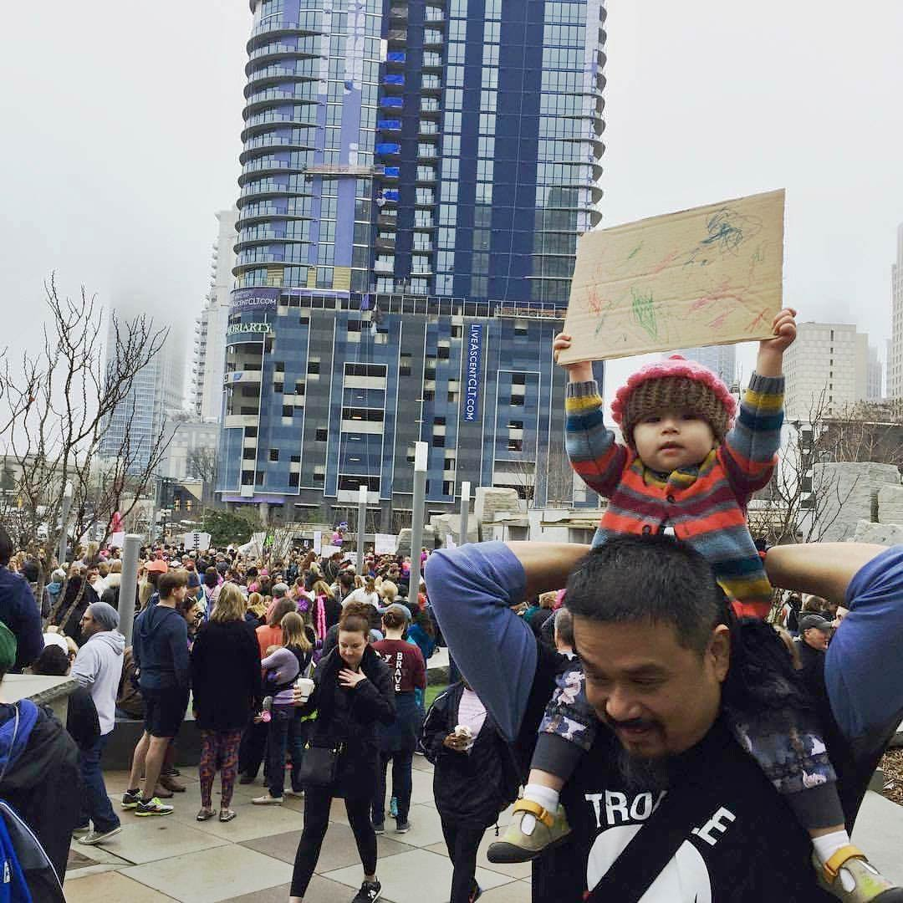

<figure>

<figcaption>
Jenny Sowry’s 22-month-old daughter proudly displays the sign she made at the Women’s March in Charlotte, North Carolina on 21 Januany 2017. 
<small>(Photo source: <a href="https://www.huffingtonpost.com/entry/toddler-protest-sign-womens-march-washington-charlotte_us_58861fcce4b096b4a2330682">Jenny&nbsp;Sowry</a>)</small>
</figcaption>
</figure>

 

Deep down people know some aspects of the way they are living are wrong.
As we go about our business we have moments where an acute awareness of the
distateful nature of the activity or behavior takes hold. Moments that in their
most benign form amount to a psychic wince, a mental flinch over whatever
malevolent impulse we have succumb to. The way people use the word mindfulness
seems intended to contradict the willful blindness to these moments of acute
awareness. That by describing and practicing focused concentration,
contemplation, and introspection one might avoid malevolent impulses altogether.

Interpretations of the literal and semantic meaning of mindfulness work both for
 and against this. Positively, we have connotations of fullness of mind, psychic
 wholeness, mental completion, the state of having traversed the inner void.
 Negatively, we have the state of being full of mind, suggesting a cacophony of
 the kind of nagging inner voices meditation and attention to spirit quiet and
 quell.

 Maybe “being awake” is another way to verbalize the positive side of
 mindfulness. People use “woke” to signify an awakened sense of compassion for all
 and recognition of our obligation to defend and support our fellow beings.
