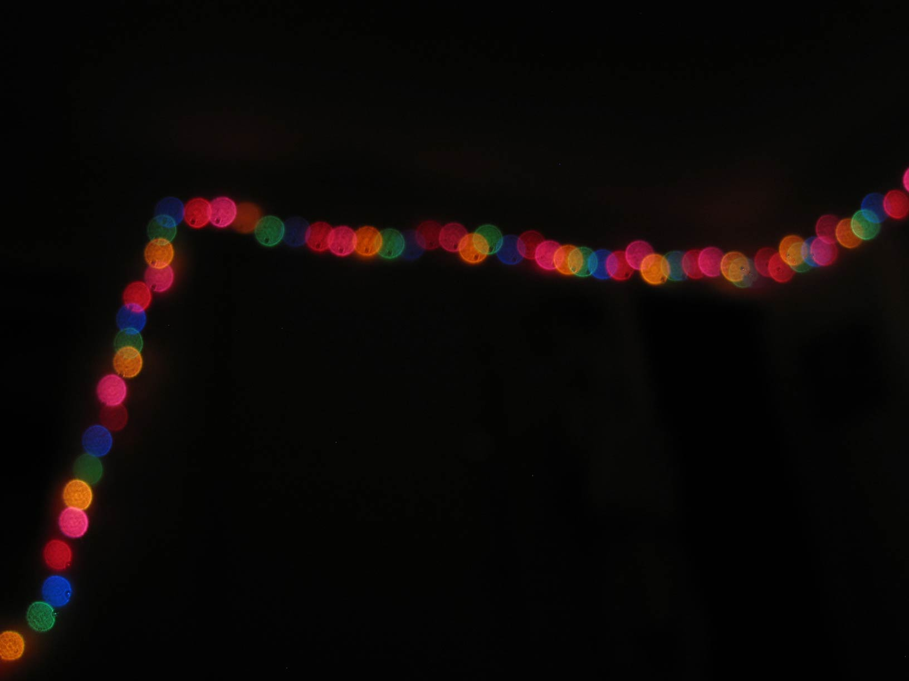

<figure class="mw848">
 
<figcaption>
  Taken 9 August 2010 Canon PowerShot&nbsp;S80 f/2.8 | 1/2&nbsp;sec | 5.8&nbsp;mm
</figcaption>
</figure>

 

Just dug this up from the archive to add to <a href="https://mastodon.social/@rdela">my Mastodon</a> header. Viva el fediverso&hellip;como <a href="https://pixelfed.social/p/rdela/32752">Pixelfed</a>&nbsp;y&nbsp;<a href="https://mastodon.social/@rdela/101431643343266647">Mastodon</a>.
