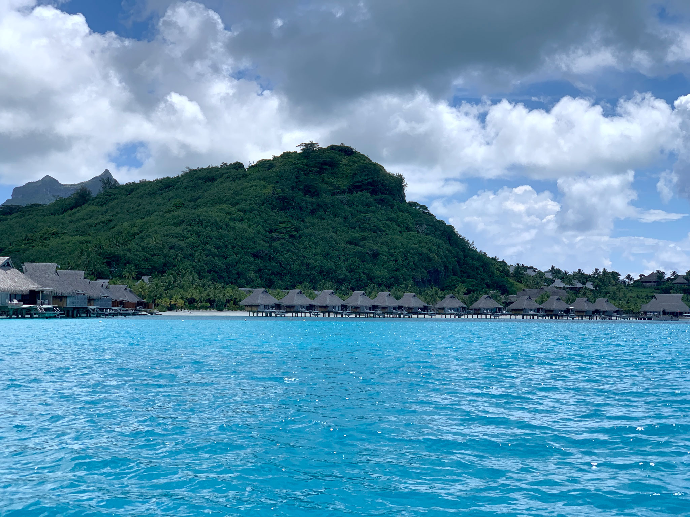

<figure class="mw848">

<figcaption>
Taken 12&nbsp;February&nbsp;2019 Apple iPhone&nbsp;XS f/2.4 | 1/1199&nbsp;sec | 6&nbsp;mm | <a href="https://goo.gl/maps/tDVw1xWALARJXFNZ8">Satellite&nbsp;Map</a></figcaption>
</figure>

Turquoise water leads up to the beach and a lush green hill above the overwater bungalows at the [Bora&nbsp;Bora](https://en.wikipedia.org/wiki/Bora_Bora) [Nui&nbsp;Resort](https://conradhotels3.hilton.com/en/hotels/french-polynesia/conrad-bora-bora-nui-PPTBNCI/index.html) in [French&nbsp;Polynesia](https://en.wikipedia.org/wiki/French_Polynesia), with puffy white clouds in the sky over [Motu&nbsp;Toopua](https://en.wikipedia.org/wiki/Toopua). [Mount&nbsp;Otemanu](https://tahititourisme.com/en-us/island/bora-bora/) can be seen in the distance rising over the bluffs on the&nbsp;left.
