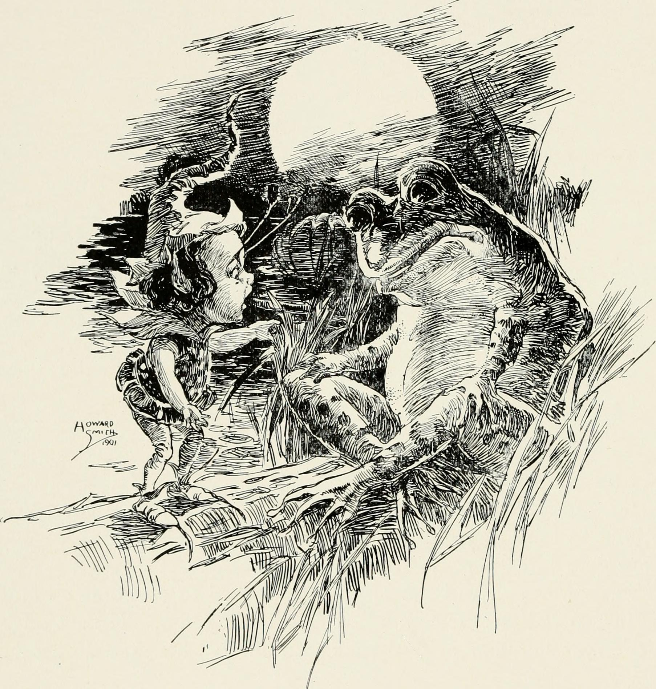

<figure>

<figcaption>
In happy far-away land (1902)<br />
<small>(Image source: <a href="https://commons.wikimedia.org/wiki/File:In_happy_far-away_land_(1902)_(14752942545).jpg">Wikimedia&nbsp;Commons</a>)</small>
</figcaption>
</figure>

&nbsp;

Welcome to the new rdela. I will be your host, Ricky de Laveaga.

I began devloping this site with [GatsbyJS](https://www.gatsbyjs.org/)
by running [^1] a

```sh
git clone
```

…of
[Gatsby Blog&nbsp;Starter](https://github.com/gatsbyjs/gatsby-starter-blog).
GBS, or `gatsby-blog`, has [Typography.js](https://github.com/KyleAMathews/typography.js)
bundled, whose
[demo&nbsp;playground](https://kyleamathews.github.io/typography.js/)
is a fun way to noodle out a proto*__type__ design*.

Anyhoo, as of this post I am using a slightly modified version of the
[Github&nbsp;theme](https://github.com/KyleAMathews/typography.js/tree/master/packages/typography-theme-github).
After much staring at the screen and tweaking CSS (hello styled-components)
Had to include the inimitable
[Source Serif](https://typekit.com/fonts/source-serif)
by [Frank Grießhammer](https://typekit.com/designers/frank-griesshammer),
[Source Sans](https://typekit.com/fonts/source-sans)
by [Paul D. Hunt](https://typekit.com/designers/paul-d-hunt),
and
[Source Code Pro](https://typekit.com/fonts/source-sans)
by [Paul D. Hunt](https://typekit.com/designers/paul-d-hunt) and
[Teo Tuominen](https://typekit.com/designers/teo-tuominen). All 3 are
part of the [*Adobe Originals*](https://blog.typekit.com/category/making-type/) series.

I cannot neglect to *issue* a hearty thanks to all of the
[Gatsby GitHub people](https://github.com/gatsbyjs/gatsby/graphs/contributors)
along with all of the [reactjs.org](https://reactjs.org/) authors and
[contributors](https://github.com/reactjs/reactjs.org/graphs/contributors).
For solid examples of common patterns in Gatsby and React, the
[reactjs.org repo](https://github.com/reactjs/reactjs.org) and
[gatsbyjs.org code](https://github.com/gatsbyjs/gatsby/tree/master/www)
are both superb open learning resources in the wild.
[bricolage.io](https://www.bricolage.io/) by
[Kyle Mathews](https://github.com/KyleAMathews/blog)
is maybe less generally useful while also being more approachable and
especially helpful to me in putting this together.

As an instant bonus for reading all the way down, I give you…[*the __F…B…I__*](https://www.youtube.com/watch?v=JI5gblI82rg)

<iframe width="720" height="405" src="https://www.youtube-nocookie.com/embed/JI5gblI82rg?rel=0&amp;controls=0&amp;showinfo=0" frameborder="0" allow="autoplay; encrypted-media" allowfullscreen></iframe>

…Or the [links page](/l) may be of interest.


&nbsp;


[^1]: Having already installed `gatsby-cli`, One could run `gatsby new gatsby-blog` [in the terminal](https://www.gatsbyjs.org/docs/) instead of `git clone` the repo like I did (for more on `git` and cloning, see [git-clone docs](https://www.git-scm.com/docs/git-clone)).

