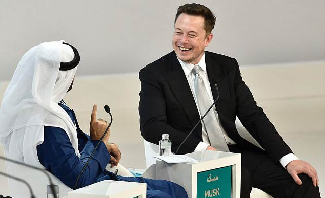
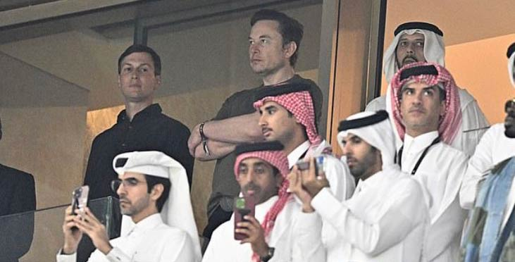

<figure class="mw634">

<figcaption>
Elon Musk grins at Mohammed Al-Gergawi, UAE Minister of Cabinet Affairs and Future, <a href="https://english.alarabiya.net/business/economy/2017/02/25/Dubai-Holding-chief-al-Gergawi-quits-to-focus-on-government-role">former chairman of Dubai Holding</a>, the investment vehicle of the emirate, in 2017 during the World Government Summit, Dubai. <a href="https://moderndiplomacy.eu/2023/02/21/dubai-summit-elon-musk-against-the-idea-of-world-government/">Musk appeared again</a> in 2023 over a video feed to rail against unity and cooperation between&nbsp;governments.
</figcaption>
</figure>

Cannot think of a better example of how woefully unprepared we are to deal with foreign influence operations than the defenestration of Twitter by repressive governments ([Saudi 🇸🇦](https://www.republicworld.com/technology-news/social-media-news/saudi-arabia-stake-in-twitter-is-becoming-talking-point-after-musks-takeover-heres-why-articleshow.html)/[UAE 🇦🇪](https://markets.businessinsider.com/news/stocks/elon-musk-twitter-bid-investor-secretive-dubai-based-vy-capital-2022-6)) using their favorite stooge Elon Musk as a patsy.

That such an obvious and easily traceable gambit to poison political discourse was such a wild success at a relatively affordable price for the players involved has set an diabolical precedent. 
Yet everyone pretends to care about hypothetical threats TikTok/ByteDance poses and floats along unquestioningly as unenforceable bans, hilarious attempts to nationalize sovereign foreign assets, and other daydreams and hallucinations get passed off as policy.

> Twitter: Forty four billion dollars.
>
> Silencing political discourse: Priceless.
>
> Some things in life are priceless. For everything else, there’s soulless patsies and bribed regulators.

Reminds me of this Chris Jankowski quote about project REDMAP, which was a Republican undertaking to use gerrymandering as a national strategy, from the excellent documentary [Slay the Dragon](https://www.slaythedragonfilm.com) (streaming on [Hulu](https://www.hulu.com/movie/slay-the-dragon-3835d61e-bde9-44de-8eba-bb2cafba4b93) and [Kanopy](https://www.kanopy.com/en/product/slay-dragon) currently), [paraphrased here by co-director Chris Durrance](https://www.rogerebert.com/interviews/advocates-for-democracy-barak-goodman-and-chris-durrance-on-the-gerrymandering-documentary-slay-the-dragon):

> [Chris Jankowski] took control of a large number of states and basically the lower house of Congress for the best part of ten years and did it in a marathon political sense for peanuts (for about $30 million).

<figure class="mw730">

<figcaption>Elon Musk and former White House senior adviser Jared Kushner during the 2022 FIFA World Cup final at Lusail Stadium in Lusail,&nbsp;Qatar.</figcaption>
</figure>
