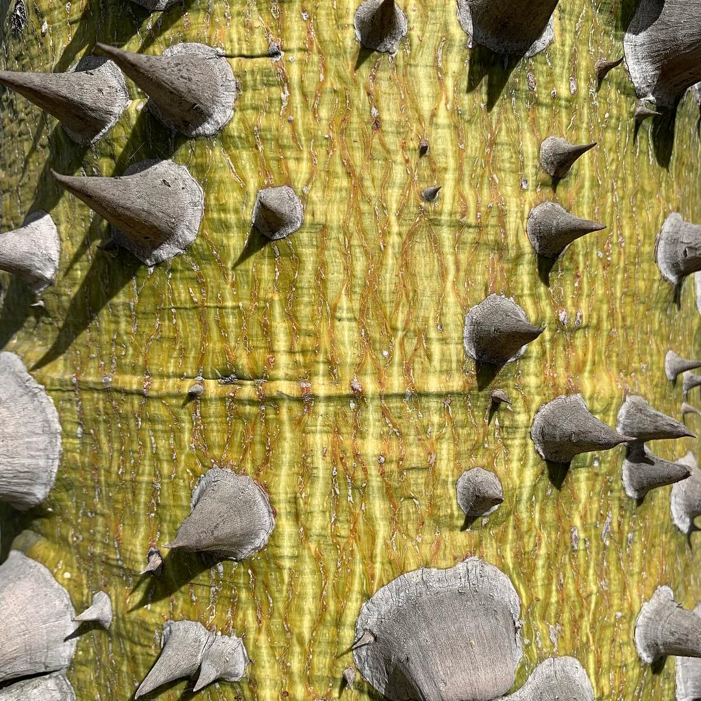

<figure>
 
<figcaption style="font-style: normal">Árbol de lana, the silk floss tree,
 also known as palo&nbsp;borracho, drunken&nbsp;stick 🦠🌵🌴</figcaption>
</figure>

In Bolivia, it is called toborochi, meaning “tree of refuge” or
 “sheltering&nbsp;tree.”[^toborochi]

> ## [Legend of the Toborochi&nbsp;Tree](http://www.boliviabella.com/legend-of-the-toborochi.html)
>
> When the world was still very new, the Aña, or spirits of the darkness, liked to abuse and murder humans. Then they found out that Araverá, the beautiful daughter of cacique Ururuti, who had married the god Colibri (Hummingbird), was pregnant and would give birth to a son. The spirits believed the son would punish them when he grew up, so they decided to kill&nbsp;Araverá.
>
> With the help of a flying seat her husband Colibrí had given to her, Araverá fled from the village, but the evil spirits followed her and harassed her wherever they found her&nbsp;hiding.
>
> Tired, she decided to hide in the trunk of a Toborochi tree where she gave birth to her son in peace. The boy grew up and fulfilled the prophecy, killing the spirits and avenging his mother, who had to stay inside the tree until she&nbsp;died.
>
> Forever buried in the amphora-shaped trunk of a Toborochi, Araverá likes to come outside in the shape of a beautiful flower that attracts hummingbirds, that way, she keeps contact with her husband. This legend is from Santa&nbsp;Cruz,&nbsp;Bolivia.

– [BoliviaBella.com](http://www.boliviabella.com/legend-of-the-toborochi.html)

Thanks to [Karen Clark’s excellent article for SF Gate Home&nbsp;Guides](https://homeguides.sfgate.com/types-trees-spikes-bark-68119.html)
  on trees “with the spiky bark,” I was able to track this one down. I searched
  “[tree spiky&nbsp;bark](https://start.duckduckgo.com/?q=tree+spiky+bark).”

[^toborochi]:
 [BoliviaBella.com](http://www.boliviabella.com/legend-of-the-toborochi.html)
 via
 [Ceiba speciosa on Wikipedia](https://en.wikipedia.org/wiki/Ceiba_speciosa),
 see also
 [Ceiba chodatii on Wikipedia](https://en.wikipedia.org/wiki/Ceiba_chodatii),
 which is what I believe this specimen in the photo to&nbsp;be:

 > Another tree of the same genus, Ceiba chodatii, is often referred to by the
   same common&nbsp;names.

 – [Ceiba speciosa on Wikipedia](https://en.wikipedia.org/wiki/Ceiba_speciosa)
