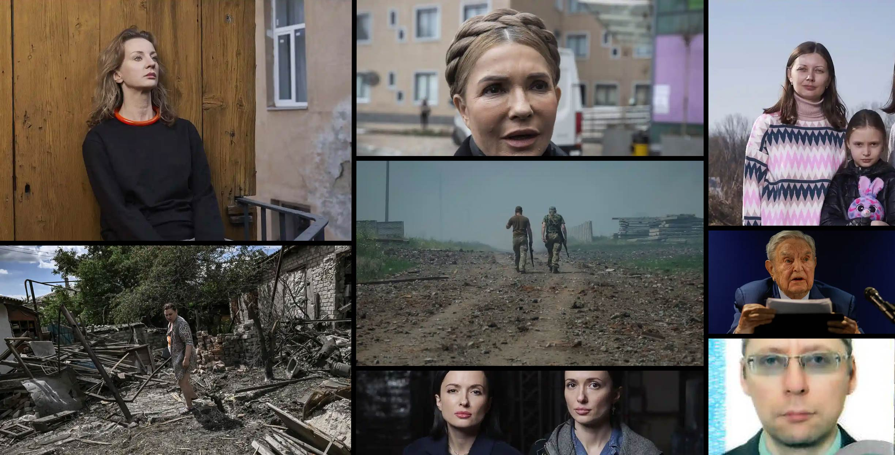

<figure class="mw848">

<figcaption>
<small>Source Photos clockwise from top L: Diana Berg/<a href="https://www.theguardian.com/global-development/2022/jun/06/tomorrow-tomorrow-putin-will-come-the-2014-ukraine-refugees-forced-to-flee-for-a-second-time">Sergey Korovayny</a>, Yulia Tymoshenko/Anadolu Agency (<a href="https://www.aa.com.tr/en/russia-ukraine-crisis/ukrainians-have-strength-to-defend-themselves-but-the-world-must-do-its-part-yulia-tymoshenko/2527064">Jeyhun Aliyev?</a>), Anastasiia and Natasha Doroshenko/<a href="https://www.theguardian.com/global-development/2022/jun/06/tomorrow-tomorrow-putin-will-come-the-2014-ukraine-refugees-forced-to-flee-for-a-second-time">Sergey Korovayny</a>, George Soros/The Guardian, Boris Bondarev, Ksenia and Tetiana Ivanov/<a href="https://www.theguardian.com/global-development/2022/jun/06/tomorrow-tomorrow-putin-will-come-the-2014-ukraine-refugees-forced-to-flee-for-a-second-time">Sergey Korovayny</a>, unidentified woman/Aris Messinis, unidentified soldiers/Gleb&nbsp;Garanich</small>
</figcaption>
</figure>

Looking at the [Guardian US](https://www.theguardian.com/us) site this morning, I was dismayed to see these two Opinion pieces featured so prominently with no&nbsp;counterpoint.

- ### [It is in the best interests of Ukraine, and the west, to end this war as soon as&nbsp;possible](https://www.theguardian.com/commentisfree/2022/jun/09/it-is-in-the-best-interests-of-ukraine-and-the-west-to-end-this-war-as-soon-as-possible)

  Christopher S Chivvis

- ### [The west’s calls for a total victory in Ukraine can lead only to ruinous&nbsp;escalation](https://www.theguardian.com/commentisfree/2022/jun/09/west-victory-in-ukraine-escalation-war)

  Simon Jenkins

Both articles display a wild misunderstanding of the reality of Russia’s aggression and Putin’s ultimate goal, which is the restoration of the Soviet empire. Appeasement will not work this time any better than it did in 2008 and 2014, and by promoting these Putin-friendly viewpoints so carelessly (that contradict so much of its own valuable reporting) The Guardian has lost my trust and has me considering canceling my yearly digital&nbsp;subscription.

For counterpoints that demolish the arguments made in the two dreary, misguided articles above,&nbsp;see:

- ### [Yulia Tymoshenko on war in Ukraine: ‘It’s a chance for the free world to kill this&nbsp;evil’](https://www.theguardian.com/world/2022/jun/08/yulia-tymoshenko-on-war-in-ukraine-russia-putin)

  Luke Harding and Dan Sabbagh in&nbsp;Kyiv

- ### [‘Tomorrow, tomorrow, Putin will come’: the 2014 Ukraine refugees forced to flee for a second&nbsp;time](https://www.theguardian.com/global-development/2022/jun/06/tomorrow-tomorrow-putin-will-come-the-2014-ukraine-refugees-forced-to-flee-for-a-second-time)

  Photojournalist Serhii Korovayny has twice uprooted his family because of Russian invasion. He talks to others with the same&nbsp;experience 
  by Sergey Korovayny

- ### [Ukraine invasion may be start of ‘third world war’, says George&nbsp;Soros](https://www.theguardian.com/business/2022/may/24/ukraine-invasion-may-be-start-of-third-world-war-says-george-soros)

  Veteran philanthropist tells World Economic Forum civilisation ‘may not survive’ what is&nbsp;coming 
  Larry Elliott *Economics editor*

- ### [‘Warmongering, lies and hatred’: Russian diplomat in Geneva resigns over Ukraine&nbsp;invasion](https://www.theguardian.com/world/2022/may/23/warmongering-lies-and-hatred-russian-diplomat-in-geneva-resigns-over-ukraine-invasion)

  Boris Bondarev issues public statement saying: ‘Never have I been so ashamed of my&nbsp;country’ 
  Andrew Roth, Moscow correspondent

If all of this is depressing you, as it should, I invite you to read [Virginia Heffernan’s](https://www.wired.com/author/virginia-heffernan/) excellent [Volodymyr Zelensky and the Art of the War Story](https://www.wired.com/story/volodymyr-zelensky-video-ukraine-war/) for Wired, that contains this refreshing passage:

> Zelensky’s [first video of the war](https://www.youtube.com/watch?v=Fwzb_JX7u04) appeared on February 23, the eve of the invasion. In Russian, he addresses *“grazhdanam Rossi”*—the citizens of Russia—as a *“grazhdanin Ukraini”*—citizen of Ukraine. The word citizens and not people reminds listeners that they’re members of a modern nation and not infantry in a holy war for an ethno-state. Zelensky also notably zeroes in on a Kremlin talking point that vexes him. He says, “You are told that we hate Russian culture. But how can you hate culture? Any culture?” In that moment of incomprehension, Zelensky dexterously clarifies for all the world the absurdity of a “culture war.”
>
> Let’s slow it down. Broadly speaking, a culture is a patchwork of dialects, customs, habits, music, arts, mores, ways of living. In Russia, culture might include everything from forest folklore to vigorous strolling to the rave band Little Big. Deeper in, you might find Chagall, Turgenev, Anatoly Karpov, the Bolshoi, Lyudmila Ulitskaya. *How can a culture be hated?*
>
> I’d never thought of it that way, but of course. A culture has no budget, no government, no army. It collects no taxes; it has no CEO, bible, or headquarters. If it can’t be precisely identified, how can a nation’s whole culture, which is made up of innumerable artifacts and practices, be loathed? And yet the constant warning of the far right in Russia—and France, and the US—is that someone, somewhere, hates your culture and thus deserves to die. No one but Zelensky has ever dissolved this hollow alarmism with such dispatch.
>
> “Europe must wake up now,” Zelensky says in a [video from March 4](https://www.youtube.com/watch?v=3wWm97ZOuFQ). Where he’d been in a funereal black suit and necktie a week earlier, now he wears the olive-drab that has become his trademark. “Russian troops are firing upon the nuclear power plant in Ukraine.” He again calls his audience into being and reminds us who we are: citizens with rights, not serfs with superstitions. Specifically, he addresses “all people who know the word ‘Chernobyl.’”
>
> I dare you to read that and not call to your mind’s eye the story of Chernobyl (in the news in 1986 or on [HBO in 2019](https://www.wired.com/story/the-chernobyl-disaster-might-have-also-built-a-paradise/)) and however you understand that nuclear disaster. This is shrewd. Comprehension of this byword does indeed mark a person as informed, familiar with the dangers of nuclear tech, and mindful that lethal catastrophes are never merely local. Our understanding of history has now been both flattered and enlisted in the fight.
>
> The other video from that day serves as Part II, and it’s [aimed at Russian citizens](https://www.yahoo.com/video/zelenskiy-urges-russians-protest-plant-115924759.html). Again Zelensky is in army green. But this time he doesn’t expect his audience to startle at the mention of Chernobyl, so he issues a stern, scolding, vivid reminder of 1986 and how Russians and Ukrainians fought together as Soviets to contain the meltdown. “You have to remember irradiation,” he says, seemingly hoping the video will find its way to those who have been denied an education in history. For them, he issues a more primordial threat: “Take to the streets and say that you want to live, that you want to live on Earth without radioactive contamination. Radiation does not know where Russia is, radiation does not know where the borders of your country are.”
>
> These videos lay out two significant ideas about Russian culture. First, there’s nothing to hate in it. A culture is grounded in sensory-emotional experience; it is too vast, multifarious, and shape-shifting to be hated as a monolith. Second, Russia as an authoritarian kleptocracy is a matter of utter indifference to the planet Earth, which is the source of our shared humanity. To poison Ukraine is to poison Russia. *Say that you want to live, that you want to live on Earth.*

🌍🌏🌎
