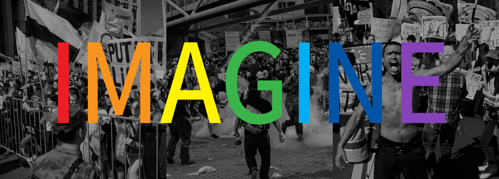

<figure class="mw848">

<figcaption>
<small>Source Photos L to R: Pavel Golovkin, Lam Yik Fei, Andrew Caballero-Reynolds</small>
</figcaption>
</figure>

Imagine Russia, China, and the USA suddenly became radically open-minded
 and loving to all of their inhabitants, embracing and accepting each
 other, practicing abolition of all forms of oppression and enslavement,
 upholding egalatarian principles, and recognizing the intersectionality
 that makes us whole.

When you hear
 [the speech Ravyn Ariah Wngz gave at Ryerson University](https://www.macleans.ca/opinion/as-a-queer-trans-and-afro-indigenous-woman-i-believed-that-i-could-never-be-a-representative-of-black-liberation/),
 you know it is the truth. You may be in various states of denying that
 truth, avoiding it, but it is still the truth.

A majority of people in Russia, China, and the USA support that truth, and
 fostering it into being is simply a matter of triggering the conditions
 that allow that transformation, that transcendence, to take place.
