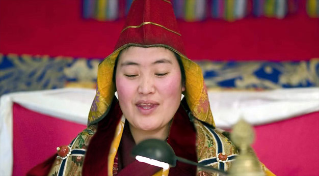

<figure class="mw313">
 
<figcaption><a href="http://www.vajrayana.it/jetsun_ani_rinpoche.htm">Jetsun Ani Sherab Chotso&nbsp;Rinpoche</a></figcaption>
</figure>

 

*The text below is translated from Vajrayana.it article, [Jetsun Ani Sherab Chotso Rinpoche](http://www.vajrayana.it/jetsun_ani_rinpoche.htm), which is the source of the image above as well.*

Jetsun Khacho Wangmo, also known as Ani Sherab Chotso Rinpoche, is one of the few Lama women in Tibet and is authorized to give initiations and teachings. She has been recognized by many as a living emanation of Tara—female representation of enlightenment and compassion in Tibetan Buddhism—of Samantabhadri, Yeshe Tsogyal and Macig Labdron.

In her previous incarnation, Jetsunma was Chimey Wangmo—a physician and accomplished yogini—daughter of the great Adzom Drukpa (1842-1924). Pema Wangyal, her brother in the previous life is still her brother, Adzom Rinpoche, in this life. Together they continue their Dharma activities for the benefit of all beings and to continue propagating the teachings of lineage.

Born in eastern Tibet in 1975, Jetsunma entered a monastic college when she was 7 years old and began a rigorous study of Buddhist texts. At the age of 13, she took monastic vows. In 2001, at the age of 26, she had to interrupt her studies for a year to obtain the qualification of Khenpo by SS Jigme Phuntsok Rinpoche. Only her recognition as Tulku allowed Jetsunma to receive a complete education, and both she and Adzom Rinpoche are deeply committed to transmitting the teachings to nuns in Tibet. Jetsuma also works tirelessly to support the practice of nuns by improving their health and living conditions.

Although she usually works “behind the scenes” during the teachings tours of Adzom Rinpoche, Jetsunma has often officiated the initiations of Green Tara and Chenrezig. Her initiations of Green Tara usually lead to a significant number of practitioners crying with emotion. Many report being confused by her inner and outer beauty and claiming they can not stop looking at her.

The purity of Jetsunma’s voice has the same effect of inspiration. In Tibet she is invited to sing on the occasion of the most important monastic rituals and initiations, in the presence of hundreds, and sometimes thousands, of monks seated in prayer. Those who have been lucky enough to hear [the sound of her voice](/om-tare-tam-svaha/) can not forget her radiant purity. Her presence shines in the same way and this is the reason why everyone loves her.
