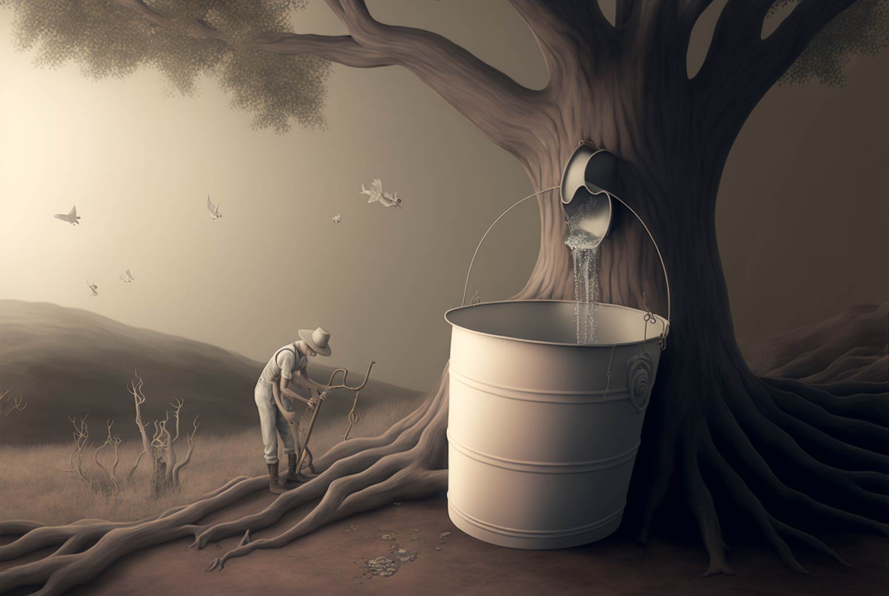

<figure class="mw848">

<figcaption>
  Generated by the author with <a href="https://midjourney.com/">Midjourney</a>
</figcaption>
</figure>

the silent peal  
the quiet wail  
the hollow well  
the empty pail
