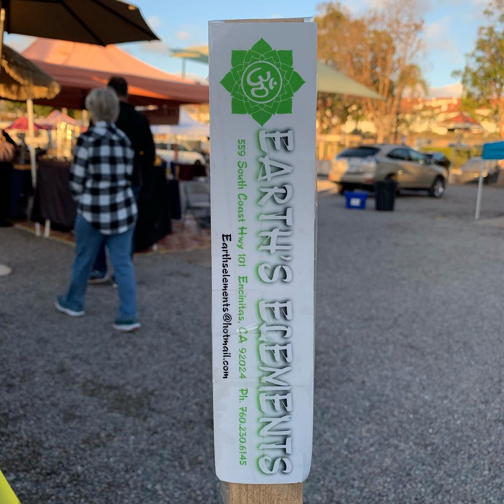

<figure>
 
<figcaption>
 Urban Buddha by <a href="https://www.tashinorbu.com">Tashi&nbsp;Norbu</a>, a
 sculpture made of plastic waste reclaimed from the&nbsp;Ocean.
</figcaption>
</figure>

<figure>
 
<figcaption>
 Front side of brochure from
 <a href="https://www.museumofcontemporarytibetanart.com">Museum of Contemporary Tibetan&nbsp;Art</a>
</figcaption>
</figure>

<figure>
 
<figcaption>
 Back side of brochure from
 <a href="https://www.museumofcontemporarytibetanart.com">Museum of Contemporary Tibetan&nbsp;Art</a>
</figcaption>
</figure>

<figure>
 
<figcaption>
 <a href="https://www.shopearthselements.com">Earth’s&nbsp;Elements</a> flyer
 for Tashi&nbsp;Norbu&nbsp;event
</figcaption>
</figure>

<figure>
 
<figcaption>
 <a href="https://www.shopearthselements.com">Earth’s Elements</a> sticker
</figcaption>
</figure>

Stumbled on this in Encinitas and had to document it. Together we can save our
 oceans, seas, and the rest of the planet. Ditching plastic by using as little
 as you can is a&nbsp;start.

🕉☸️💠🗑🌊

Video in this
 [Facebook post from United Nations For a Free&nbsp;Tibet](https://www.facebook.com/219532248180934/posts/1403327093134771/) shared by
 [Tashi&nbsp;Norbu](https://www.facebook.com/TashiNorbuArt/)
